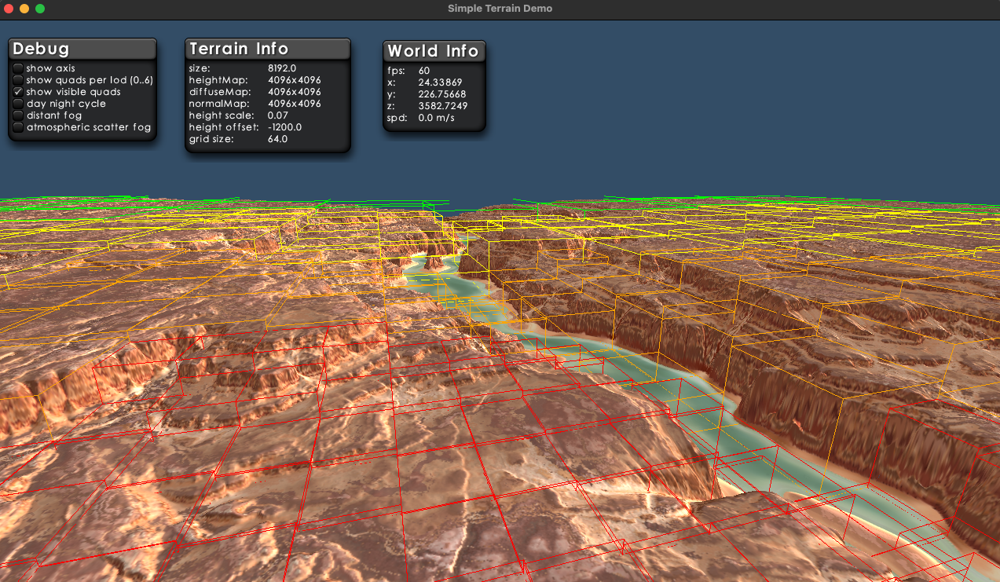

<!-- TOC -->
* [CDLOD Terrain Surface Rendering for LibGDX - DEMO](#cdlod-terrain-surface-rendering-for-libgdx---demo)
  * [The demo showcases](#the-demo-showcases)
  * [Navigation & Debug Controls](#navigation--debug-controls)
  * [Before Running](#before-running)
<!-- TOC -->

# CDLOD Terrain Surface Rendering for LibGDX - DEMO

- This project is a companion to the main [libgdx-cdlod](https://github.com/istvandudas/libgdx-cdlod) library.
- Its purpose is to demonstrate how to integrate and use CDLOD terrain rendering within a LibGDX application.

## The demo showcases
Two sets of high‑quality terrain height, diffuse, and normal textures sourced from [MotionForgePictures](https://www.motionforgepictures.com/height-maps/):
- Canyon and River
  
- Grand Mountain
  
  - This pack does not include a normal map. It provides a bump map instead, which is not yet supported by cdlod-terrain, this is the reason of the light quality drop.

Both heightmaps are prepared according to the cdlod-terrain requirements:
- Linear RGBA8888 format with 
- RG‑encoded 16‑bit height values.

You can switch between the two terrain sets in [TerrainDemo.java (lines 68–74)](https://github.com/istvandudas/libgdx-cdlod-demo/blob/src/main/java/org/cdlod/terrain/TerrainDemo.java#L68-L74)
- by toggling the commented texture assignments.
- the missing normal map for Grand Mountain is not a problem, but you will need to adjust the height offset and scale.

## Navigation & Debug Controls
- The project includes a simple FirstPersonController that allows you to freely fly around the scene.
  - Movement: W, A, S, D
  - Speed boost: Left Shift, Left Control, or Left Shift + Left Control for increasing levels of acceleration

- Show Axis displays the three coordinate axes using colored lines.
- Show Quads per LOD (0–6) visualizes the quad bounding boxes for each LOD level. 
- Select the LOD level using the number keys 0–6 (top row, not the numpad).
  - You may need to fly slightly above the terrain to get a clear view.
- Show Visible Quads highlights the quads currently visible to the camera.
  - Colors represent LOD levels:
    - Gray = LOD0
    - White = LOD1
    - Blue = LOD2
    - Green = LOD3
    - Yellow = LOD4
    - Orange = LOD5
    - Red = LOD6
  - The visualization updates continuously as you move, reflecting camera distance and CDLOD’s morphing behavior.
- Fog and the day/night cycle are straightforward and self‑explanatory.

## Before Running
- macOS
  - Add the following VM argument when launching the application: "-XstartOnFirstThread"